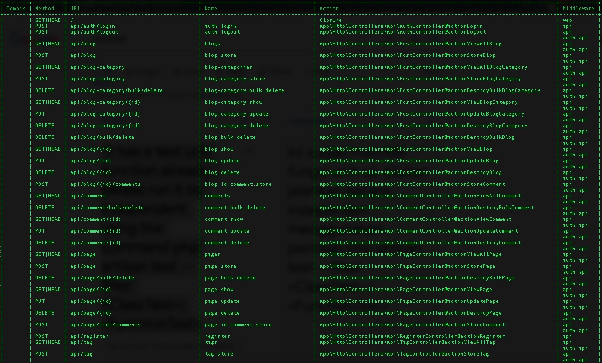
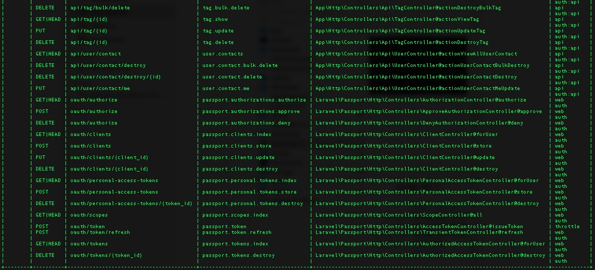

## Setup
1. Clone the source with git clone https://github.com/satryawiguna/emeet.git
2. Go to root project folder cd ./rest-api
3. Run on terminal composer install
4. Adjust some config variable on enviroment file i.e APP_URL, DB_DATABASE etc
5. Run php artisan migrate
6. Run php artisan passport:install --uuids
7. Run php artisan db:seed
8. It has a test unit function already, please run it by independent using the command php artisan test --filter <ClassTest>::<FunctionTest>

